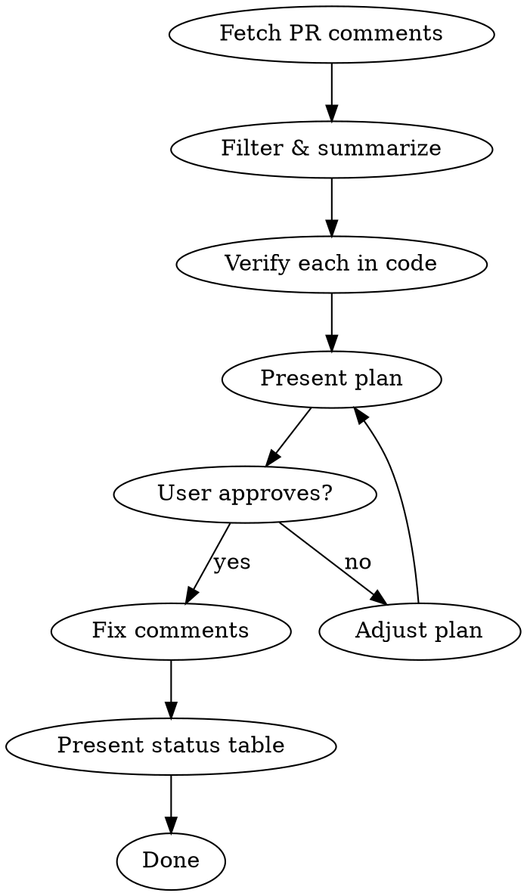

# Address PR Review Feedback

Fetches review comments on YOUR PR from Bitbucket, plans fixes, and implements them.

## Prerequisites

Requires the [Bitbucket MCP server](#bitbucket-mcp-setup) to be configured.

## Trigger

`/code-review:address-feedback <bitbucket-pr-url>`

---

## Workflow



### Step 1: Fetch Comments

Use Bitbucket MCP to get PR comments. Filter out bots (CodeRabbit, etc.) and your own comments.

```
# Get PR metadata
bb_get /repositories/{workspace}/{repo}/pullrequests/{id}
  jq: {title, author: author.display_name, state, source_branch: source.branch.name}

# Get comment index first (skip content to save tokens)
bb_get /repositories/{workspace}/{repo}/pullrequests/{id}/comments
  pagelen: 50
  jq: values[*].{id, author: user.display_name, file: inline.path, line: inline.to, resolved, parent_id: parent.id}

# Fetch full content of each reviewer comment individually
bb_get /repositories/{workspace}/{repo}/pullrequests/{id}/comments/{comment_id}
  jq: {id, content: content.raw, file: inline.path, line: inline.to}
```

**Token optimization:** Fetch index first (no content), identify reviewer comment IDs (skip bots and PR author), then fetch each individually.

### Step 2: Summarize & Present

Present all comments in a table:

| # | Reviewer | Comment | File | Status |
|---|----------|---------|------|--------|
| 1 | Name | Brief description | `file:line` | To fix / Disagree / Question |

- **To fix** — Valid issue, will address
- **Disagree** — Technically incorrect or not applicable (explain why)
- **Question** — Need clarification before proceeding

### Step 3: Verify Each Comment Against Code

Before planning any fix, check the actual code:

```bash
git show HEAD:<file-path>
```

For each comment:
1. Read the relevant code
2. Is the reviewer's concern valid for THIS codebase?
3. Would the suggested fix break anything?
4. Is there context the reviewer might be missing?

**If a comment seems wrong:** Present technical reasoning to the user. Do not silently skip or blindly implement.

### Step 4: Present Fix Plan

For each "To fix" comment, present:

```
Comment #1: [brief description]
File: path/to/file:line
Plan: [what to change and why]
```

Wait for user approval before implementing.

### Step 5: Implement Fixes

Two modes based on user preference:

**One by one (default):**
1. Make the change
2. Verify no regressions (run relevant test if applicable)
3. Present status table with updated statuses
4. Suggest commit message (single line)
5. Wait for user to confirm before next

**Batch mode (if user requests):**
1. Implement all approved fixes
2. Present final status table
3. Suggest a single commit message covering all changes

After each fix (or batch), present the updated status table:

| # | Comment | File | Status |
|---|---------|------|--------|
| 1 | Use constant | `config.php:12` | Done |
| 2 | Add validation | `OrderService.php:45` | Done |
| 3 | Remove unused import | `Helper.php:3` | Remaining |

### Step 6: Handle Disagreements

For comments marked "Disagree", draft a response for the user to post on Bitbucket:

```
Comment #N by [reviewer]: "[their comment]"
Suggested reply: [technical reasoning why current approach is correct or better]
```

---

## Key Behaviors

- **Verify before fixing** — read the code, don't blindly implement reviewer suggestions
- **Push back when wrong** — if reviewer lacks context or is technically incorrect, say so with reasoning
- **User posts replies** — draft disagreement responses but let user post them on Bitbucket
- **Skip resolved comments** — only process unresolved comments
- **Resend status table** — after each fix, show the full table with updated statuses
- **Suggest commit messages** — single line, no body, no co-author
